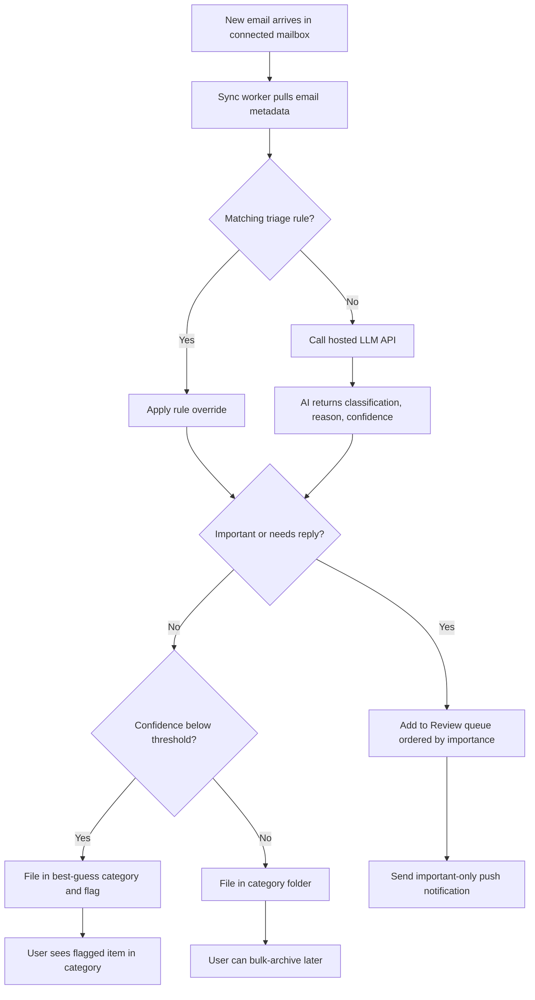
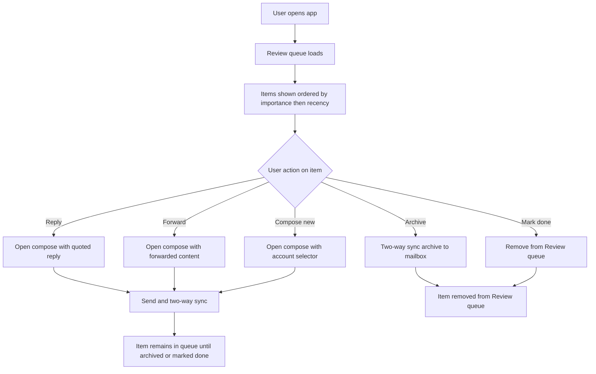
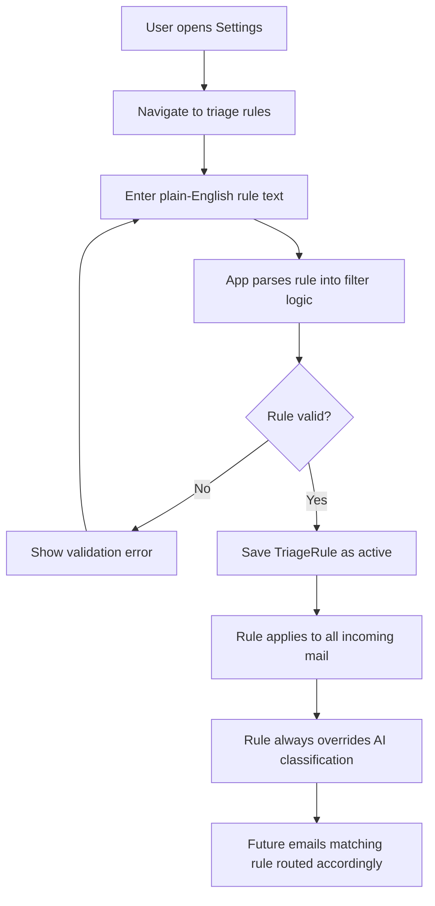
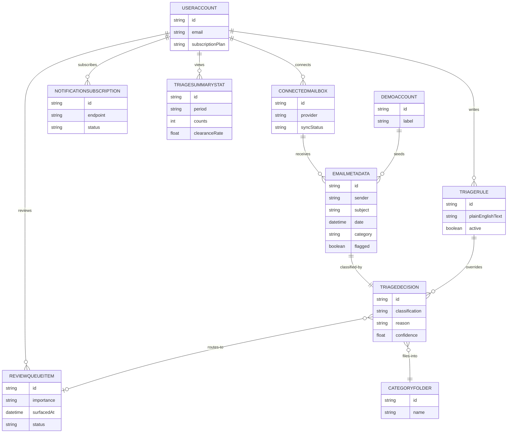

# Triage Mail PRD

Busy professionals and small-business owners juggle multiple email accounts and lose hours each day scanning cluttered inboxes to find what actually needs their attention. Most email clients treat every message equally, leaving the user to manually filter signal from noise across Gmail, Outlook, and other providers.

Triage Mail solves this by connecting multiple mailboxes into one unified interface and running an AI agent that classifies every incoming email — important/needs-a-reply, FYI, newsletters, marketing, receipts, automated notifications — and routes it accordingly. Important items land in a short, prioritized Review queue that the user opens each day instead of a raw inbox; everything else is filed into category folders for later skimming or bulk-clearing.

Users can write plain-English rules that always override the AI, set per-sender overrides, and see a short reason and confidence level on each triaged item so they can trust the system. The app stores only email metadata, never body content, and all actions two-way sync back to the original mailboxes.

The product is a web-only, single-user SaaS with a monthly or yearly subscription, targeting high-volume knowledge workers who want to spend time only on the mail that matters.

## Goals

- Reduce the time high-volume email users spend scanning cluttered inboxes by surfacing only important mail in a prioritized Review queue each day.
- Unify multiple Gmail and Outlook mailboxes into a single triage-first interface where all actions two-way sync back to the original accounts.
- Give users deterministic control over routing through plain-English rules that always override AI classification.
- Build user trust in AI triage by showing a short reason and confidence level on every triaged item.
- Protect user privacy by storing only email metadata, never persisting email body content.

## Non-goals

- Learning from user corrections to improve AI triage — deferred to post-v1.
- Native mobile applications — the product is web-only (responsive PWA) for v1.
- IMAP support beyond Gmail and Outlook — providers like iCloud, Yahoo, and Fastmail are deferred to post-v1.
- Team, shared inbox, or multi-user collaboration features — the product is single-user only.
- One-click unsubscribe for marketing mail — not included in v1 scope.
- Custom user-created category folders — v1 ships a fixed default catalog of categories.
- Email body content storage or full-text search across email bodies — only metadata is persisted.
- Throttling, batching, or rate-limiting of AI triage — all incoming mail is processed regardless of volume.

## Target users

- Busy professionals with high email volume who juggle multiple inboxes and want to spend time only on mail that matters.
- Small-business owners who receive client, vendor, and automated mail across Gmail and Outlook accounts and need a prioritized daily queue.
- Knowledge workers who live in email and want a power-tool interface optimized for fast triage with keyboard-first interactions.

## Design & UX direction (look & feel)

Triage Mail is a calm, scannable, keyboard-first productivity tool that feels like a power tool for high-volume email. The Review queue is the hero screen — a short, prioritized list the user opens daily instead of a raw inbox. Neutral surfaces, a single confident accent for important items, and restrained semantic color keep high-volume sessions from feeling chaotic, while consistent icon language and purposeful motion reinforce fast, confident triage.

- **Audience:** High-volume knowledge workers and small-business owners who live in email across multiple accounts and want to spend time only on what matters. They are power users who expect keyboard shortcuts, fast scanning, and a tool that stays out of the way.
- **Visual style:** Clean, modern, icon-led productivity tool — calm and scannable, optimized for fast triage. The full visual design system (color tokens, type scale, spacing, component styles, and landing direction) is specified in the dedicated Design Spec document.
- **Tone of voice:** Plain and direct — concise labels, no marketing fluff. Rule descriptions and notifications read like clear instructions, and triage reasons are short and factual so users can trust the system at a glance.
- **Color:** Neutral base with white/near-white surfaces and soft gray borders; a single confident accent for the Review queue and important items; subtle semantic color for flags and categories without overwhelming. Exact color tokens are defined in the Design Spec.
- **Typography:** System or neutral sans-serif (e.g. Inter) throughout, with tight readable sizing for dense lists and clear weight hierarchy between sender, subject, and metadata. Exact type scale and tokens are defined in the Design Spec.
- **Layout density:** Balanced — enough items visible per screen for efficient scanning without feeling cramped, with generous row height for click/tap comfort. Exact spacing tokens are defined in the Design Spec.
- **Navigation:** Persistent left sidebar on desktop with entries for Review queue, category folders, Compose, Triage summary stats, and Settings; collapses to a compact icon rail or drawer on smaller screens. The Reconnect banner appears persistently at the top when a connected mailbox loses access.
- **Component library:** shadcn/ui + Tailwind — clean, composable primitives that suit an icon-led, keyboard-first interface.
- **Accessibility:** WCAG AA with keyboard-first interactions — full keyboard navigation, shortcuts for archive/reply/forward/mark-done, visible focus states, and screen-reader-friendly queue and list semantics.

**Platforms:**
- Responsive web app (desktop-first)
- Installable PWA

**Key screens to nail:**
- Review queue
- Category folder view
- Compose
- Settings
- Triage summary stats
- Reconnect banner
- Demo account

**Design principles:**
- Scannability first — the Review queue must let users triage dozens of items per minute with clear visual hierarchy.
- Keyboard is the primary input — every queue action has a shortcut and a visible focus path.
- Icons carry meaning — use consistent icon language for categories, flags, and actions; avoid decorative-only imagery.
- Motion is purposeful — subtle transitions on archive/move confirm the action, never delay the workflow.
- Rules feel trustworthy — plain-English rule descriptions read exactly as the user wrote them, reinforcing that rules override AI.
- Calm under volume — neutral palette and restrained color use keep high-volume sessions from feeling chaotic.

## Roles

### User

The single account owner who connects one or more Gmail/Outlook mailboxes, writes plain-English triage rules, reviews important mail in the Review queue, composes and replies to email, and bulk-archives category folders.

_Can:_
- Connect multiple Gmail and Outlook mailboxes with two-way sync
- View and act on a unified Review queue ordered by importance then recency
- Reply, forward, compose, archive, or mark done on any email
- Create, edit, and delete plain-English triage rules that override AI classification
- Bulk-select and archive items in category folders
- View triage summary stats (counts by category, daily trends, queue clearance rate)
- Receive web push notifications only when important mail enters the Review queue
- Reconnect mailboxes that have lost access via a reconnect banner
- Manage subscription billing (monthly or yearly)

### DemoUser

A trial visitor who explores a pre-seeded demo account with realistic sample emails to experience AI triage without connecting a real mailbox.

_Can:_
- Browse a seeded Review queue with pre-triaged sample emails
- Explore category folders with sample marketing, newsletter, receipt, and FYI mail
- View triage reasons and confidence levels on sample items
- Try reply, forward, compose, archive, and mark-done actions in a sandbox
- View triage summary stats for the demo account

## User stories

- **As an User**, I want to connect one or more Gmail or Outlook mailboxes so that all my email is unified in one interface with two-way sync back to the original accounts..
  - _Acceptance:_ User can initiate OAuth connection to Gmail and Outlook from the Settings screen.
  - _Acceptance:_ Once connected, the app begins syncing mail metadata within 60 seconds.
  - _Acceptance:_ Archive, move, reply, and send actions performed in Triage Mail are reflected in the original mailbox within one sync cycle.
- **As an User**, I want to open a prioritized Review queue each day so that I see only the important items that need my attention instead of scanning a raw inbox..
  - _Acceptance:_ Review queue displays items ordered by importance first, then recency.
  - _Acceptance:_ Each item shows sender, subject, date, triage reason, and confidence level.
  - _Acceptance:_ Items remain in the Review queue until the user manually archives or marks them done.
- **As an User**, I want to reply to or forward an email directly from the Review queue so that I can handle important mail without leaving the app and the action syncs back to the original mailbox..
  - _Acceptance:_ Reply and forward actions open a compose view pre-populated with the correct thread context.
  - _Acceptance:_ Sent replies and forwards appear in the original mailbox's Sent folder via two-way sync.
  - _Acceptance:_ After replying or forwarding, the item remains in the Review queue until manually archived or marked done.
- **As an User**, I want to compose and send a new email from a chosen connected account so that I can send mail from any of my connected mailboxes without switching clients..
  - _Acceptance:_ Compose screen includes a connected-account selector defaulting to the account of the last opened item.
  - _Acceptance:_ Sent emails appear in the originating mailbox's Sent folder via two-way sync.
- **As an User**, I want to create plain-English triage rules that always override the AI so that I can deterministically control how specific senders or subjects are routed..
  - _Acceptance:_ User can enter a rule as natural-language text (e.g., 'Anything from my accountant is always important') in Settings.
  - _Acceptance:_ When a rule and the AI disagree on classification, the rule's routing decision is applied.
  - _Acceptance:_ Rules apply to new incoming mail only and do not retroactively re-triage already-processed emails.
  - _Acceptance:_ User can edit and delete existing rules from the Settings screen.
- **As an User**, I want to bulk-select and archive items in a category folder so that I can quickly clear marketing, newsletter, or receipt clutter in one action..
  - _Acceptance:_ Category folder view supports multi-select via checkboxes or keyboard selection.
  - _Acceptance:_ Bulk archive action moves all selected items to archive in the original mailbox via two-way sync.
  - _Acceptance:_ Archived items disappear from the category folder view immediately.
- **As an User**, I want to see a triage reason and confidence level on every triaged item so that I can trust the AI's classification and know when to double-check flagged items..
  - _Acceptance:_ Every item in the Review queue and category folders displays a one-sentence triage reason.
  - _Acceptance:_ Every item displays a confidence level (high, medium, or low).
  - _Acceptance:_ Low-confidence items are visually flagged with a distinct icon in their category folder.
- **As an User**, I want to receive a web push notification only when important mail enters the Review queue so that I am alerted to time-sensitive email without being notified about newsletters or marketing..
  - _Acceptance:_ Web push notification is sent only when an email is classified as important and routed to the Review queue.
  - _Acceptance:_ Notification includes sender and subject of the important email.
  - _Acceptance:_ User can enable or disable notifications in Settings.
- **As an User**, I want to see a reconnect banner when a connected mailbox loses access so that I can re-authenticate and resume sync without silently losing triage on that account..
  - _Acceptance:_ A persistent banner appears at the top of the app when a connected account's OAuth token is expired or revoked.
  - _Acceptance:_ Clicking the banner initiates the OAuth re-authentication flow for the affected account.
  - _Acceptance:_ Sync resumes automatically within 60 seconds of successful re-authentication.
- **As an User**, I want to view triage summary stats so that I can understand how my mail is being triaged over time and how quickly I am clearing my Review queue..
  - _Acceptance:_ Stats screen shows counts by category for the current week and previous week.
  - _Acceptance:_ Stats screen shows a daily trend chart of Review queue items added vs. cleared.
  - _Acceptance:_ Stats screen shows the queue clearance rate as a percentage of items archived or marked done within 24 hours of arrival.
- **As a DemoUser**, I want to explore a pre-seeded demo account with realistic sample emails so that I can experience AI triage without connecting a real mailbox or creating an account..
  - _Acceptance:_ Demo account is accessible without signup and contains at least 50 pre-triaged sample emails across all categories.
  - _Acceptance:_ Demo Review queue shows at least 10 important items with reasons and confidence levels.
  - _Acceptance:_ Demo category folders contain sample marketing, newsletter, receipt, FYI, and automated-notification emails.
  - _Acceptance:_ Reply, forward, compose, archive, and mark-done actions work in the demo sandbox but do not send real email.

## Core workflows

### Open Review queue

**Actor:** User
**Preconditions:**
- User is authenticated and has at least one ConnectedMailbox with active two-way sync
- At least one incoming email has been triaged as important and routed to the Review queue

**Steps:**
1. User navigates to the Review queue (default landing screen after login)
2. System loads all ReviewQueueItems for the user across all connected mailboxes, ordered by importance score descending, then received date descending
3. Each item displays sender, subject, date, source mailbox, AI reason, and confidence badge; low-confidence items show a flag indicator
4. User selects an item to expand inline or open a reading pane showing full metadata and available actions
5. User chooses to reply, forward, compose a new email, archive, or mark done
6. If user replies or forwards, the Compose screen opens pre-populated with the item context (see Reply or forward from Review queue workflow)
7. If user archives or marks done, the item is removed from the Review queue and the action is two-way synced to the source mailbox (see Clear Review queue item workflow)
8. User continues through remaining items until the queue is empty or the user navigates away

**Outcome:** The user has reviewed and acted on important emails from a single prioritized list, and each action is reflected in both Triage Mail and the original mailbox.

### Triage incoming email

**Actor:** User
**Preconditions:**
- User has at least one ConnectedMailbox with active two-way sync
- A new email arrives in the source mailbox and is detected via Gmail Pub/Sub or Microsoft Graph change notifications

**Steps:**
1. System receives a push notification or polls the source mailbox for new messages since the last sync cursor
2. System fetches the full email content from the provider API for triage purposes only — body content is not persisted
3. System evaluates all active TriageRules in priority order against the email metadata and content; if any rule matches, the rule's target destination (Review queue or category folder) is applied and the AI step is skipped for routing
4. If no rule matches, system sends the email's sender, subject, snippet, and headers to the hosted LLM API with a classification prompt requesting category, importance score (0–100), confidence (0–1), and a one-sentence reason
5. LLM returns a TriageDecision containing category, importance, confidence, and reason
6. If confidence is below 0.70, the item is flagged as low-confidence regardless of category
7. System creates an EmailMetadata record (sender, subject, date, category, flags, importance, confidence, reason, source mailbox ID, provider message ID) — no body content is stored
8. If category is important/needs-reply, a ReviewQueueItem is created; otherwise the item is filed under the matching CategoryFolder
9. If the item landed in the Review queue and the user has an active NotificationSubscription, a web push notification is sent with sender and subject
10. If the item is low-confidence and filed in a category folder, it appears in that folder with a visible flag indicator so the user can spot misclassifications

**Outcome:** Every incoming email is classified and routed to either the Review queue or a category folder, with metadata persisted, body content discarded, and the user notified only for important items.

### Bulk-archive category folder

**Actor:** User
**Preconditions:**
- User is authenticated and has at least one CategoryFolder containing triaged emails
- Two-way sync is active for the source mailboxes of the items to be archived

**Steps:**
1. User navigates to a CategoryFolder (e.g., Marketing, Newsletters, Receipts) from the left sidebar
2. System loads all EmailMetadata records filed under that category, ordered by date descending
3. Each row displays sender, subject, date, source mailbox, and a flag indicator if low-confidence
4. User clicks a checkbox or uses shift-click to multi-select a range of items; a bulk action bar appears showing the count selected
5. User can optionally filter or sort before selecting (e.g., select all from a specific sender, select all older than 30 days)
6. User clicks the Archive button in the bulk action bar
7. System sends archive commands to the source mailbox APIs (Gmail archive removes the INBOX label; Outlook moves to Archive folder) for each selected item, batching API calls to respect rate limits
8. System updates each EmailMetadata record to reflect archived status and removes the items from the category folder view
9. If any API call fails, the item remains visible with an error indicator and the user can retry; successfully archived items are removed from the list

**Outcome:** The user has cleared multiple non-important emails from a category folder in a single action, and the archive is reflected in both Triage Mail and the original mailboxes.

### Create triage rule

**Actor:** User
**Preconditions:**
- User is authenticated and has at least one ConnectedMailbox
- User navigates to Settings → Triage Rules section

**Steps:**
1. User clicks 'Add rule' to open a new rule form
2. User enters a plain-English description in a single text field (e.g., 'Always mark emails from my accountant as important', 'Treat anything from newsletter@company.com as marketing')
3. System parses the natural-language input into structured filter logic: conditions (sender, subject keywords, domain) and action (route to Review queue or specific CategoryFolder)
4. System displays a parsed summary back to the user in plain English (e.g., 'When sender contains "accountant.com" → Route to Review queue') so the user can verify the interpretation
5. If the parse is ambiguous, system shows the best interpretation and highlights the uncertain part, allowing the user to rephrase and re-submit
6. User can optionally set a priority order relative to existing rules by dragging the rule in the list; higher rules are evaluated first
7. User clicks Save; the TriageRule is stored as active and will be evaluated against all future incoming emails before the AI
8. System confirms the rule is active and shows it in the ordered rule list with its plain-English description and parsed summary
9. Rules apply to new incoming mail only — already-triaged emails are not retroactively re-routed

**Outcome:** A new TriageRule is active and will deterministically override AI classification for matching incoming emails, giving the user guaranteed control over specific senders or patterns.

### Connect mailbox

**Actor:** User
**Preconditions:**
- User is authenticated and has an active subscription
- User has not exceeded the maximum connected mailboxes allowed by their subscription tier (default: 5)

**Steps:**
1. User navigates to Settings → Connected Accounts and clicks 'Connect mailbox'
2. User selects a provider: Gmail or Outlook
3. System initiates OAuth flow with the selected provider using scopes for read mail, send mail, and modify labels/folders
4. User authorizes the connection in the provider's consent screen
5. System receives and securely stores the OAuth refresh token and creates a ConnectedMailbox record with status 'active'
6. System performs an initial sync: fetches recent emails (default: last 30 days) from the inbox, triages each via the LLM, and populates the Review queue and category folders
7. System subscribes to push notifications (Gmail Pub/Sub or Microsoft Graph change notifications) for real-time new-mail detection
8. User sees the newly connected mailbox in the Connected Accounts list with a 'Syncing' indicator, then 'Active' when initial sync completes
9. Review queue and category folders now include items from this mailbox, unified with any previously connected accounts

**Outcome:** A new mailbox is connected, initial historical mail is triaged, and real-time two-way sync is active so all future mail is automatically classified and all user actions sync back.

### Reconnect lost mailbox

**Actor:** User
**Preconditions:**
- A ConnectedMailbox has lost access due to expired OAuth token, revoked permission, or provider-side issue
- System has detected the sync failure and marked the mailbox status as 'disconnected'

**Steps:**
1. System detects a persistent sync failure (token refresh fails or API returns auth error) and sets the ConnectedMailbox status to 'disconnected'
2. A Reconnect banner appears at the top of every screen (Review queue, category folders, Compose, Settings, Stats) naming the affected mailbox
3. User clicks 'Reconnect' in the banner and is redirected to the OAuth flow for the affected provider
4. User re-authorizes the connection in the provider's consent screen
5. System receives a new refresh token, updates the ConnectedMailbox record, and sets status back to 'active'
6. System resumes sync from the last known cursor, triaging any emails that arrived during the disconnection period
7. The Reconnect banner disappears once the mailbox is active and sync is caught up
8. If the user dismisses the banner without reconnecting, it reappears on the next page load and the mailbox remains paused

**Outcome:** The mailbox is reconnected, any missed emails are triaged, and two-way sync resumes without data loss.

### Compose new email

**Actor:** User
**Preconditions:**
- User is authenticated and has at least one ConnectedMailbox with active sync
- User navigates to Compose via the sidebar or a 'Compose' button

**Steps:**
1. User opens the Compose screen
2. A 'From' dropdown defaults to the user's primary connected mailbox but lets the user choose any connected account
3. User enters recipient(s) in the To field with CC and BCC toggle options; autocomplete suggests from previously contacted addresses
4. User enters a subject line and email body in a rich-text editor (bold, italic, links, lists)
5. User can optionally attach files (uploaded directly to the provider's send API; not stored by Triage Mail)
6. User clicks Send
7. System sends the email via the selected provider's API (Gmail send or Microsoft Graph send) using the chosen From account
8. System stores a metadata-only record of the sent email (recipient, subject, date, source mailbox) for reference; no body content is persisted
9. The sent email appears in the source mailbox's Sent folder via two-way sync
10. User sees a confirmation toast and the Compose form clears or closes

**Outcome:** A new email is sent from the selected connected account, delivered via the provider's API, and reflected in the source mailbox's Sent folder.

### Reply or forward from Review queue

**Actor:** User
**Preconditions:**
- User is viewing the Review queue and has selected a ReviewQueueItem
- The source mailbox for the item has active two-way sync

**Steps:**
1. User clicks Reply, Reply All, or Forward on a ReviewQueueItem
2. The Compose screen opens pre-populated: From is set to the item's source mailbox, To is set to the original sender (and all recipients for Reply All), subject is prefixed with 'Re:' or 'Fw:' as appropriate, and the original email's metadata is quoted in the body
3. For Forward, the To field is left blank for the user to specify recipients
4. User writes the reply or forward content in the rich-text editor
5. User clicks Send
6. System sends the email via the source mailbox's provider API, threading it as a reply to the original message where the provider supports threading
7. System updates the ReviewQueueItem to show a 'Replied' or 'Forwarded' badge but does not automatically remove it from the queue — the user must still archive or mark done to clear it
8. The sent reply appears in the source mailbox's Sent folder via two-way sync

**Outcome:** The user has replied to or forwarded an important email directly from the Review queue without leaving the app, and the action is synced to the original mailbox.

### Clear Review queue item

**Actor:** User
**Preconditions:**
- User is viewing the Review queue with at least one ReviewQueueItem
- The source mailbox for the item has active two-way sync

**Steps:**
1. User selects an item in the Review queue
2. User clicks 'Archive' to archive the email or 'Mark done' to mark it as handled without archiving
3. If Archive: system sends an archive command to the source mailbox API (Gmail removes INBOX label; Outlook moves to Archive folder) and updates the EmailMetadata record to archived
4. If Mark done: system updates the ReviewQueueItem status to 'done' without moving the email in the source mailbox; the email remains in the inbox on the provider side but is removed from the Triage Mail Review queue
5. In both cases, the item is removed from the Review queue view immediately with a subtle animation confirming the action
6. An 'Undo' toast appears for 5 seconds allowing the user to reverse the action if it was accidental
7. The Review queue count in the sidebar updates to reflect the removed item
8. Keyboard shortcuts (E for archive, Shift+E for mark done) are available for power users

**Outcome:** The item is removed from the Review queue, the action is synced to the source mailbox if applicable, and the user can continue triaging remaining items.

### View triage summary stats

**Actor:** User
**Preconditions:**
- User is authenticated and has at least one ConnectedMailbox that has been actively triaging email
- At least one day of triage data exists for the user

**Steps:**
1. User navigates to the Triage summary stats screen from the sidebar
2. System aggregates TriageSummaryStat data for the user across all connected mailboxes
3. Dashboard displays: total emails triaged, count by category (Review queue, Marketing, Newsletters, Receipts, FYI, Automated notifications), daily trend line for the last 30 days, and Review queue clearance rate (items cleared vs. items received per day)
4. User can toggle the date range (last 7 days, last 30 days, last 90 days)
5. User can see the percentage of emails that were low-confidence flagged, indicating AI accuracy over time
6. User can see the number of emails routed by user rules vs. by AI, showing how much manual control the user is exercising
7. No export functionality is available in v1; the stats are view-only

**Outcome:** The user has a clear picture of how much email is being triaged, how it's distributed across categories, and how effectively they are clearing their Review queue over time.

## Workflow diagrams

### Triage incoming email

### Open Review queue

### Create triage rule

## Screens and pages

### Review queue

The primary daily landing screen showing a prioritized, unified list of important emails across all connected mailboxes that need the user's attention.

**Used by:** User
**Key elements:**
- Queue header with item count and last-updated timestamp
- Ordered list of ReviewQueueItems sorted by importance score descending, then received date descending
- Each row: sender name, subject, preview snippet (first 100 chars of metadata), date/time, source mailbox indicator (Gmail/Outlook icon), AI confidence badge (color-coded: green ≥0.85, yellow 0.70–0.84, red flag <0.70), one-sentence AI reason on hover or inline
- Low-confidence flag icon on items below the 0.70 threshold
- Inline action buttons per row: Reply, Forward, Archive, Mark done
- Reading pane (toggleable) on the right showing full metadata for the selected item
- Empty state with illustration and message: 'Your Review queue is clear — nothing needs your attention right now'
- Keyboard shortcut hints: J/K to move up/down, R to reply, F to forward, E to archive, Shift+E to mark done

**Primary actions:**
- Select an item to view full metadata in the reading pane
- Reply to an item (opens Compose pre-populated)
- Forward an item (opens Compose pre-populated)
- Archive an item (removes from queue, syncs to source mailbox)
- Mark an item as done (removes from queue without archiving in source mailbox)
- Compose a new email (navigates to Compose screen)
- Navigate items via keyboard shortcuts

### Category folder view

A list view for non-important emails filed under a specific category (Marketing, Newsletters, Receipts, FYI, Automated notifications), enabling quick skimming and bulk clearing.

**Used by:** User
**Key elements:**
- Folder header with category name, item count, and last-updated timestamp
- Filter bar: filter by sender, date range, source mailbox, and low-confidence flag only
- Ordered list of EmailMetadata records sorted by date descending
- Each row: checkbox, sender name, subject, date, source mailbox indicator, low-confidence flag icon if applicable
- Sticky bulk action bar that appears when one or more items are selected, showing count and an Archive button
- Select-all checkbox in the header to select all items matching the current filter
- Empty state: 'No emails in this category — you're all caught up'

**Primary actions:**
- Select individual items via checkbox
- Shift-click to select a range of items
- Select all items matching the current filter
- Bulk-archive selected items (syncs to source mailboxes)
- Filter items by sender, date, mailbox, or flag status
- Click an item to view its full metadata in a reading pane

### Compose

A full email composition screen for new emails, replies, and forwards, with a connected-account selector so the user can send from any linked mailbox.

**Used by:** User
**Key elements:**
- 'From' dropdown listing all connected mailboxes with their email addresses and provider icons
- To, CC, and BCC recipient fields with autocomplete from previously contacted addresses
- Subject line text input (auto-prefixed with 'Re:' or 'Fw:' for replies/forwards)
- Rich-text body editor supporting bold, italic, bullet lists, numbered lists, and hyperlinks
- Attachment upload area (files are passed directly to the provider send API; not stored by Triage Mail)
- Send button (disabled until at least one recipient and a subject or body are present)
- Cancel/Discard button with confirmation if content has been entered
- For replies/forwards: quoted original email metadata (sender, date, subject) displayed below the compose area
- Keyboard shortcut: Cmd/Ctrl+Enter to send, Esc to cancel

**Primary actions:**
- Select which connected mailbox to send from
- Enter recipients (To, CC, BCC)
- Write subject and body with rich-text formatting
- Attach files
- Send the email via the selected provider's API
- Cancel and discard the draft

### Settings

Central configuration screen for managing connected mailboxes, plain-English triage rules, and notification preferences.

**Used by:** User
**Key elements:**
- Connected Accounts section: list of connected mailboxes with email address, provider icon, sync status (Active, Syncing, Disconnected), last sync time, and a Disconnect button per account; 'Connect mailbox' button at the top
- Triage Rules section: ordered list of active TriageRules showing the user's plain-English description and the system's parsed summary; drag-to-reorder for priority; Add, Edit, and Delete buttons per rule; toggle to enable/disable a rule without deleting it
- Add/Edit rule form: single plain-English text input, parsed-summary preview, and save button
- Notification Preferences section: toggle for important-email web push notifications, with a test notification button; list of active push subscription devices
- Subscription section: current plan (monthly/yearly), renewal date, and a link to manage billing via Stripe customer portal
- Account section: sign out button and account email

**Primary actions:**
- Connect a new Gmail or Outlook mailbox
- Disconnect a connected mailbox
- Add a new plain-English triage rule
- Edit an existing triage rule's description
- Delete or disable a triage rule
- Reorder triage rules by priority (drag and drop)
- Toggle important-email push notifications on/off
- Send a test push notification
- Manage subscription billing via Stripe portal
- Sign out

### Triage summary stats

A dashboard showing how the AI and user rules have been triaging email over time, helping the user understand volume distribution and their own Review queue habits.

**Used by:** User
**Key elements:**
- Date range selector: last 7 days, last 30 days (default), last 90 days
- Summary cards: total emails triaged, average per day, Review queue clearance rate (%), low-confidence rate (%)
- Category breakdown bar chart: count of emails per category (Review queue, Marketing, Newsletters, Receipts, FYI, Automated notifications) for the selected range
- Daily trend line chart: emails received vs. Review queue items cleared per day over the selected range
- Rules vs. AI pie chart: percentage of emails routed by user rules vs. by AI classification
- Top senders list: top 10 senders by email count in the selected range, with their dominant category
- No export button in v1 — stats are view-only

**Primary actions:**
- Toggle date range (7 / 30 / 90 days)
- Hover over chart data points for exact counts
- Click a category in the breakdown chart to navigate to that CategoryFolder view
- Review queue clearance rate and low-confidence rate to assess AI accuracy and personal habits

### Reconnect banner

A persistent alert bar displayed at the top of every screen when a connected mailbox has lost access, prompting the user to re-authenticate so sync can resume.

**Used by:** User
**Key elements:**
- Full-width banner pinned below the top navigation, using a warning color (amber)
- Warning icon and message: 'Connection lost for [email address]. Sync is paused for this mailbox.'
- 'Reconnect now' button that initiates the OAuth flow for the affected provider
- 'Dismiss' (X) button that hides the banner for the current session; banner reappears on next page load if still disconnected
- If multiple mailboxes are disconnected, the banner lists all affected addresses with a single 'Reconnect all' button

**Primary actions:**
- Click 'Reconnect now' to re-authenticate the disconnected mailbox via OAuth
- Click 'Reconnect all' if multiple mailboxes are disconnected
- Dismiss the banner for the current session

### Demo account

A pre-seeded sample environment with realistic emails that lets trial visitors explore Triage Mail's triage, Review queue, and category folders without connecting a real mailbox.

**Used by:** DemoUser
**Key elements:**
- Pre-seeded DemoAccount with 3 simulated mailboxes (2 Gmail-style, 1 Outlook-style) containing 200+ realistic sample emails across all categories
- Review queue pre-populated with 15 important items showing varied confidence levels, AI reasons, and at least 2 low-confidence flagged items
- Category folders pre-populated: Marketing (40 items), Newsletters (30 items), Receipts (15 items), FYI (25 items), Automated notifications (20 items)
- Triage summary stats pre-populated with 30 days of realistic trend data
- Two sample triage rules already active (e.g., 'Always mark emails from ceo@democompany.com as important', 'Treat emails from marketing@democompany.com as marketing')
- Prominent 'Connect your real mailbox' CTA banner at the top of the Review queue encouraging upgrade from demo to real account
- All compose/reply/forward actions are simulated — no real emails are sent; a toast confirms 'Demo mode: email not actually sent'
- No subscription or billing screen accessible in demo mode

**Primary actions:**
- Browse the Review queue and interact with sample items (reply, forward, archive, mark done — all simulated)
- Open category folders and bulk-archive sample items
- View and edit sample triage rules
- View the Triage summary stats dashboard with pre-seeded data
- Open the Compose screen and simulate sending an email
- Click 'Connect your real mailbox' to transition to the real account signup/connect flow

## Data model

### UserAccount

The signed-up user with a subscription and one or more connected mailboxes.

| Field | Type | Notes |
| --- | --- | --- |
| id | text | Unique identifier |
| email | text | Login email address |
| name | text | Display name |
| subscriptionPlan | text | monthly or yearly |
| subscriptionStatus | text | trial, active, past_due, cancelled |
| trialEndsAt | date | End date of free trial; null after first paid subscription |
| createdAt | date | Account creation timestamp |
| updatedAt | date | Last updated timestamp |

**Relationships:**
- has many ConnectedMailbox
- has many TriageRule
- has many ReviewQueueItem (via EmailMetadata)
- has many TriageSummaryStat
- has one NotificationSubscription

### ConnectedMailbox

A Gmail or Outlook account linked for two-way sync.

| Field | Type | Notes |
| --- | --- | --- |
| id | text | Unique identifier |
| userId | link to UserAccount | Owning user |
| provider | text | gmail or outlook |
| emailAddress | text | The mailbox's email address |
| displayName | text | User-facing label for this mailbox |
| status | text | connected, syncing, paused, error, disconnected |
| lastSyncedAt | date | Timestamp of last successful sync |
| oauthRefreshToken | text | Encrypted OAuth refresh token for provider API |
| syncCursor | text | Provider-specific cursor or delta token for incremental sync |
| connectedAt | date | When the mailbox was first connected |

**Relationships:**
- belongs to UserAccount
- has many EmailMetadata

### EmailMetadata

Sender, subject, date, category, flags, importance, and confidence for a triaged email. No body content is stored.

| Field | Type | Notes |
| --- | --- | --- |
| id | text | Unique identifier |
| mailboxId | link to ConnectedMailbox | Which mailbox received this email |
| providerMessageId | text | Original message ID from Gmail/Outlook for two-way sync |
| threadId | text | Provider thread/conversation ID for grouping replies |
| sender | text | Sender email address |
| senderName | text | Sender display name |
| subject | text | Email subject line |
| receivedAt | date | Timestamp the email was received by the provider |
| category | text | important, fyi, newsletters, marketing, receipts, automated_notifications |
| importance | text | high, medium, low — drives Review queue ordering |
| confidence | text | AI confidence score 0.0–1.0 |
| isFlagged | yes/no | True when AI confidence is below 0.7 and the item needs user attention |
| hasAttachments | yes/no | Whether the original email has attachments |
| attachmentCount | text | Number of attachments if any |
| labels | list | Provider-side labels/folders currently applied |
| status | text | untriaged, triaged, archived |
| triagedAt | date | When AI triage completed for this email |

**Relationships:**
- belongs to ConnectedMailbox
- has one TriageDecision
- has one ReviewQueueItem (if category is important)

### TriageRule

A plain-English rule that always overrides AI classification.

| Field | Type | Notes |
| --- | --- | --- |
| id | text | Unique identifier |
| userId | link to UserAccount | Owning user |
| plainEnglishText | text | The rule exactly as the user wrote it, e.g. 'Anything from my accountant is always important' |
| parsedConditions | list | Structured filter logic derived from the plain-English text by the LLM parser: field, operator, value triples |
| targetCategory | text | Category the rule routes to: important, fyi, newsletters, marketing, receipts, automated_notifications |
| priority | text | Integer ordering; higher priority rules evaluated first |
| status | text | active, paused, deleted |
| createdAt | date | When the rule was created |
| updatedAt | date | Last modified timestamp |

**Relationships:**
- belongs to UserAccount

### CategoryFolder

A bucket for non-important mail such as Marketing, Newsletters, Receipts, or FYI.

| Field | Type | Notes |
| --- | --- | --- |
| id | text | Unique identifier |
| userId | link to UserAccount | Owning user (each user has the same predefined set) |
| name | text | fyi, newsletters, marketing, receipts, automated_notifications |
| displayName | text | User-facing label, e.g. 'Marketing', 'Newsletters' |
| isSystem | yes/no | Always true in v1 — all categories are predefined; users cannot create custom categories |
| unreadCount | text | Cached count of untriaged/unarchived items in this folder |

**Relationships:**
- belongs to UserAccount
- has many EmailMetadata (by category)

### ReviewQueueItem

An important email surfaced for the user to reply, forward, or clear.

| Field | Type | Notes |
| --- | --- | --- |
| id | text | Unique identifier |
| userId | link to UserAccount | Owning user — the Review queue is unified across all connected mailboxes |
| emailMetadataId | link to EmailMetadata | The triaged email this item represents |
| status | text | active, archived, done |
| orderRank | text | Computed sort key combining importance level and recency for queue ordering |
| addedAt | date | When the item entered the Review queue |
| clearedAt | date | When the user archived or marked done; null while active |
| clearAction | text | archive or done — how the user removed it; null while active |

**Relationships:**
- belongs to UserAccount
- belongs to EmailMetadata

### TriageSummaryStat

Aggregated counts and trends showing how mail was triaged over time.

| Field | Type | Notes |
| --- | --- | --- |
| id | text | Unique identifier |
| userId | link to UserAccount | Owning user |
| date | date | The calendar day these stats cover |
| totalEmails | text | Total emails received that day |
| importantCount | text | Emails triaged to the Review queue |
| fyiCount | text | Emails filed as FYI |
| newslettersCount | text | Emails filed as Newsletters |
| marketingCount | text | Emails filed as Marketing |
| receiptsCount | text | Emails filed as Receipts |
| automatedNotificationsCount | text | Emails filed as Automated Notifications |
| flaggedCount | text | Low-confidence items flagged that day |
| queueClearedCount | text | Review queue items the user archived or marked done that day |
| queueRemainingCount | text | Review queue items still active at end of day |

**Relationships:**
- belongs to UserAccount

### TriageDecision

The AI's classification, reason, and confidence for a single email.

| Field | Type | Notes |
| --- | --- | --- |
| id | text | Unique identifier |
| emailMetadataId | link to EmailMetadata | The email this decision applies to |
| aiCategory | text | The category the AI chose: important, fyi, newsletters, marketing, receipts, automated_notifications |
| aiImportance | text | high, medium, low — the AI's importance assessment |
| confidenceScore | text | 0.0–1.0 confidence from the LLM |
| reason | text | Short human-readable explanation shown to the user, e.g. 'Sender is a known client; likely needs a reply' |
| finalCategory | text | The category actually applied after rules override — may differ from aiCategory |
| overriddenByRuleId | link to TriageRule | If a rule overrode the AI, the rule that won; null otherwise |
| status | text | pending, classified, rule_overridden, flagged |
| decidedAt | date | When the triage decision was made |

**Relationships:**
- belongs to EmailMetadata
- may reference TriageRule (if overridden)

### NotificationSubscription

A web push subscription for important-email alerts.

| Field | Type | Notes |
| --- | --- | --- |
| id | text | Unique identifier |
| userId | link to UserAccount | Owning user |
| endpoint | text | Web Push endpoint URL from the browser |
| p256dhKey | text | Browser-provided public key for push encryption |
| authKey | text | Browser-provided auth secret for push encryption |
| status | text | active, expired |
| createdAt | date | When the subscription was created |

**Relationships:**
- belongs to UserAccount

### DemoAccount

A seeded sample account with realistic emails for trial and testing.

| Field | Type | Notes |
| --- | --- | --- |
| id | text | Unique identifier |
| demoUserId | link to UserAccount | Transient user account created for the demo session |
| seedDatasetVersion | text | Version label for the seeded email dataset |
| seededEmailCount | text | Number of realistic sample emails loaded |
| status | text | active, expired |
| expiresAt | date | When the demo session expires; set to 24 hours after creation |
| createdAt | date | When the demo account was created |

**Relationships:**
- belongs to UserAccount (transient)
- uses same EmailMetadata and ReviewQueueItem structure with seeded data

## Business rules

| Rule | Rationale |
| --- | --- |
| Plain-English user rules always override AI classification. When a rule matches an incoming email, the rule's target category wins and the AI's category is discarded. | Users need deterministic control over routing so they can guarantee specific senders or subjects are always handled correctly. |
| Rules are evaluated in priority order before the AI triage call. If any rule matches, the AI is still called to generate a reason and confidence, but the final category comes from the rule. | Keeps the reason/confidence display consistent while ensuring rules win on routing. |
| The Review queue is ordered by importance (high before medium before low), then by recency (newest first within each importance tier). | Ensures the most urgent and freshest items are at the top for fast triage. |
| Items leave the Review queue only when the user manually archives or marks them done. Replying or forwarding does not automatically clear an item. | The user decides when an item is fully handled; auto-clearing on reply could hide items that need follow-up. |
| The AI calls a hosted LLM API once per incoming email to classify it. The LLM receives sender, subject, date, and snippet metadata but no body content is persisted after classification. | Per-email classification provides the most accurate triage; metadata-only persistence protects privacy. |
| When the AI confidence score is below 0.7, the email is filed into its best-guess category and flagged. Flagged items appear only in their category folder with a flag indicator, not in the Review queue. | Low-confidence items should not clutter the Review queue; the flag lets users spot them when skimming categories. |
| Only email metadata is stored in the app database. Full email body content is read transiently for LLM triage and then discarded; it is never persisted. | Privacy-conscious design that reduces storage cost and attack surface. |
| All actions — archive, move, send, delete — two-way sync back to the original Gmail or Outlook mailbox within 30 seconds. | Users must see consistent state whether they use Triage Mail or their native email client. |
| All incoming emails are processed regardless of volume. There is no throttling, batching, or daily cap. Background workers with retry and backoff handle provider rate limits transparently. | The product promise is that everything gets triaged; skipping or delaying mail breaks trust. |
| Notifications are sent only for important mail landing in the Review queue. No notifications are sent for category-folder mail, flagged items, or non-important classifications. | Users want to be alerted only when something needs their attention, not for every incoming email. |
| The Review queue is unified across all connected mailboxes for a user. Items from Gmail and Outlook appear in a single prioritized list. | The user opens one queue, not one per account, to see everything that needs attention. |
| Triage rules do not apply retroactively. They affect only emails received after the rule is created. | Retroactive re-triage would be computationally expensive and could disrupt items the user has already handled. |
| The predefined category folders are: FYI, Newsletters, Marketing, Receipts, and Automated Notifications. Users cannot create custom categories in v1. | A fixed catalog keeps the product simple and predictable for the first launch. |
| The LLM API cost is absorbed by the subscription. Users are not charged per-email or metered for triage. | Simple pricing model; the subscription covers all costs. |
| Subscription pricing is $12/month or $108/year (effectively 2 months free). A 14-day free trial is available with no credit card required. | Concrete price points that cover LLM and infrastructure costs while remaining competitive. |
| Only Gmail and Outlook are supported as email providers in v1. No generic IMAP support. | OAuth-based providers with push notification support are the highest-value targets; IMAP adds complexity for v1. |
| A short human-readable reason and confidence level is displayed on every triaged item in the Review queue and category folders. | Transparency builds trust in the AI's decisions and helps users understand why mail was routed a certain way. |
| Demo accounts expire 24 hours after creation. All seeded data is deleted on expiry. | Prevents demo data accumulation and keeps the system clean. |

## Permissions

| Capability | User | DemoUser |
| --- | --- | --- |
| Connect a Gmail or Outlook mailbox | ✓ |  |
| Reconnect a lost mailbox | ✓ |  |
| Disconnect a mailbox | ✓ |  |
| View Review queue (unified across mailboxes) | ✓ | ✓ |
| Reply to a Review queue item | ✓ |  |
| Forward a Review queue item | ✓ |  |
| Compose and send a new email | ✓ |  |
| Archive a Review queue item | ✓ | ✓ |
| Mark a Review queue item as done | ✓ | ✓ |
| View a category folder | ✓ | ✓ |
| Bulk-select and archive items in a category folder | ✓ | ✓ |
| Create a triage rule | ✓ |  |
| Edit a triage rule | ✓ |  |
| Delete (soft-delete) a triage rule | ✓ |  |
| Pause or resume a triage rule | ✓ |  |
| View triage summary stats | ✓ | ✓ |
| Subscribe to web push notifications | ✓ |  |
| Unsubscribe from web push notifications | ✓ |  |
| View and edit account settings | ✓ |  |
| Manage subscription billing | ✓ |  |
| Explore demo account with seeded data |  | ✓ |

## Notifications

| Trigger | Recipient | Channel | Message |
| --- | --- | --- | --- |
| An email is triaged as important and lands in the Review queue | User | web push | New important email from {senderName}: {subject} |
| A connected mailbox loses access (expired token or revoked permission) | User | in-app banner | Your {provider} account ({emailAddress}) has lost access. Click Reconnect to resume sync. |
| A connected mailbox successfully reconnects after being lost | User | in-app banner | {emailAddress} is reconnected. Sync has resumed. |
| User's free trial is 3 days from expiring | User | in-app banner | Your free trial ends in 3 days. Subscribe to keep your mailboxes connected. |
| User's subscription payment fails | User | in-app banner | Your subscription payment failed. Update your payment method to avoid service interruption. |

## Reports and exports

| Report | Purpose | Fields | Formats |
| --- | --- | --- | --- |
| Triage summary stats | Shows the user how their email is being triaged over time so they can understand volume patterns and queue clearance behavior. | date, totalEmails, importantCount, fyiCount, newslettersCount, marketingCount, receiptsCount, automatedNotificationsCount, flaggedCount, queueClearedCount, queueRemainingCount | in-app dashboard (last 30 days), CSV export |

## Success metrics & analytics

| Metric (KPI) | How it’s measured | Target |
| --- | --- | --- |
| Daily Review Queue Opens | Number of times a user opens the Review queue screen per day. This is the product's north star — it means the user chose Triage Mail over their raw inbox. | Average 1+ open per active user per weekday |
| Activation Rate | Percentage of new sign-ups who connect at least one mailbox AND open the Review queue for the first time within their first session. | 60% within first session |
| Review Queue Clearance Rate | Percentage of items that enter the Review queue and are cleared (archived or marked done) by the user within 48 hours. Shows the queue is actionable, not a dumping ground. | 70% cleared within 48 hours |
| Reply/Forward Rate from Review Queue | Percentage of Review queue items that receive a reply or forward action. Indicates the AI is surfacing mail that genuinely needs a response. | 40%+ of queue items get a reply or forward |
| Weekly Retention | Percentage of users who opened the Review queue in week 1 and return to open it again in week 2. | 50%+ week-2 retention |
| Subscription Conversion Rate | Percentage of trial or demo users who start a paid monthly or yearly subscription. | 10% of trial users convert to paid |
| Triage Rule Adoption | Percentage of active users who have created at least one plain-English triage rule. Rules increase trust and stickiness by giving users deterministic control. | 30% of active users within first week |

### Events to track

| Event | Fires when | Properties |
| --- | --- | --- |
| screen_viewed | User opens any main screen (Review queue, Category folder, Compose, Settings, Stats, Demo account) | screen_name |
| mailbox_connected | User successfully connects a Gmail or Outlook account and sync begins | provider, mailbox_count |
| review_queue_item_cleared | User archives or marks done an item in the Review queue, removing it from the queue | clear_action, mailbox_id |
| email_sent | User sends a reply, forward, or new composed email from within the app | send_type, mailbox_id |
| triage_rule_created | User saves a new plain-English triage rule | rule_count |
| category_bulk_archived | User bulk-selects and archives items in a category folder | category, item_count |
| subscription_started | User completes checkout and starts a paid subscription | plan_type |
| demo_account_opened | A trial visitor opens the pre-seeded demo account |  |

## Edge cases

| Scenario | Expected handling |
| --- | --- |
| AI confidence is below 0.7 for an incoming email | The email is filed into the AI's best-guess category folder and flagged with a visual flag indicator. It does not appear in the Review queue. The user sees the flag when browsing the category folder and can manually move it to the Review queue if needed. |
| A connected mailbox loses access due to expired OAuth token or revoked permission | The mailbox status changes to 'error' or 'disconnected'. Sync is paused. A persistent reconnect banner appears at the top of every screen. The user clicks Reconnect to re-authenticate via OAuth. Once re-authenticated, status returns to 'syncing' and incremental sync resumes from the last cursor. |
| User receives hundreds of emails in a single day | All emails are processed with no throttling or daily cap. Background BullMQ workers handle LLM triage calls concurrently with retry and exponential backoff for rate limits. The Review queue may take a few minutes to fully populate during extreme bursts, but no email is skipped. |
| A plain-English rule cannot be parsed into reliable filter logic | The rule is saved in 'paused' status with an inline error message: 'Could not understand this rule — try rephrasing.' The user can edit and resubmit. No email is affected by an unparseable rule. |
| Two triage rules conflict (both match the same email with different target categories) | The rule with the higher priority value wins. If priorities are equal, the most recently created rule wins. The TriageDecision records which rule overrode. |
| User archives or moves an email in their native Gmail/Outlook client while Triage Mail is also processing it | The provider's sync notification takes precedence. If the email was already archived on the provider side, Triage Mail removes it from the Review queue or category folder on the next sync cycle. If a two-way sync action from Triage Mail fails because the email was already moved, the error is silently logged and the local state is reconciled to match the provider. |
| An email arrives from a sender that matches both a user rule (e.g., 'always marketing') and the AI classifies it as important | The user rule wins. The email is filed as marketing. The TriageDecision shows the AI's original 'important' classification with the reason, but finalCategory is 'marketing' and overriddenByRuleId points to the matching rule. |
| User replies to a Review queue item but does not archive or mark it done | The item remains in the Review queue with status 'active'. A 'Replied' indicator appears on the item. The user must manually archive or mark done to clear it. |
| A web push notification fails to deliver because the browser subscription has expired | The NotificationSubscription status is set to 'expired'. The next time the user opens the app, they are prompted to re-enable notifications. No retry is attempted for expired subscriptions. |
| User's subscription lapses (past_due or cancelled) | Email sync and AI triage are paused. The user retains read-only access to their Review queue and category folders for 30 days. A banner prompts them to renew. After 30 days, all metadata is deleted per the data retention policy. |
| Demo account session expires mid-use | The user sees a 'Demo session expired' screen with a button to start a new demo or sign up. All seeded data from the expired session is deleted. |
| LLM API is temporarily unavailable or returns an error for a specific email | The email is held in 'untriaged' status. The worker retries with exponential backoff up to 3 attempts over 10 minutes. If all retries fail, the email is placed in the Review queue with a flag and a note: 'Triage unavailable — review manually.' This ensures no email is lost. |
| User connects the same Gmail or Outlook account twice | The second connection attempt is blocked with an error: 'This mailbox is already connected.' The user is directed to the existing connection in Settings. |

## MVP scope

- Unified Review queue ordered by importance then recency across all connected Gmail and Outlook mailboxes
- Reply, forward, and full compose new email from any connected account with two-way sync
- Manual archive or mark done to clear items from the Review queue
- AI triage via hosted LLM API call per incoming email with classification into: Important/Needs-Reply, FYI, Newsletters, Marketing & Promotions, Receipts, Automated Notifications
- Short triage reason and confidence level (high/medium/low) displayed on every triaged item
- Low-confidence items filed into their best-guess category folder and visually flagged — they do not appear in the Review queue
- Fixed default category folders: FYI, Newsletters, Marketing & Promotions, Receipts, Automated Notifications (not user-customizable in v1)
- Plain-English triage rules entered as natural-language text, parsed into filter logic, that always override AI classification on new incoming mail
- Rules can be created, edited, and deleted; rules apply to new mail only, not retroactively
- Bulk-select and archive in category folders with two-way sync
- Two-way sync of archive, move, send, and delete actions with Gmail and Outlook
- Metadata-only storage: sender, subject, date, category, flags, importance, confidence, thread ID, attachment count — no email body content persisted
- Web push notifications (VAPID) sent only when important mail enters the Review queue, with enable/disable toggle in Settings
- Reconnect banner on lost mailbox access with re-authentication flow and automatic sync resume
- Triage summary stats screen showing counts by category, daily trends, and queue clearance rate
- Monthly or yearly subscription billing via Stripe
- Demo account with at least 50 pre-seeded realistic sample emails across all categories, accessible without signup
- Responsive web app (desktop-first PWA) with keyboard-first navigation and WCAG AA accessibility

## Future enhancements

- Learning from user corrections — when the user moves a message, the AI improves future classification for similar mail
- Native mobile applications (iOS and Android)
- IMAP support for providers beyond Gmail and Outlook (iCloud, Yahoo, Fastmail, etc.)
- One-click unsubscribe for marketing and newsletter mail
- User-created custom category folders beyond the fixed default set
- Retroactive re-triage when a new rule is created or edited
- Batching or tiered LLM processing for extreme-volume users to manage cost
- Full-text search across email metadata with embedding-based similarity (pgvector)
- Per-sender override UI in addition to plain-English rules
- Team or shared inbox features for multi-user collaboration

## Implementation readiness checklist

_None._

## Open questions

_None._
